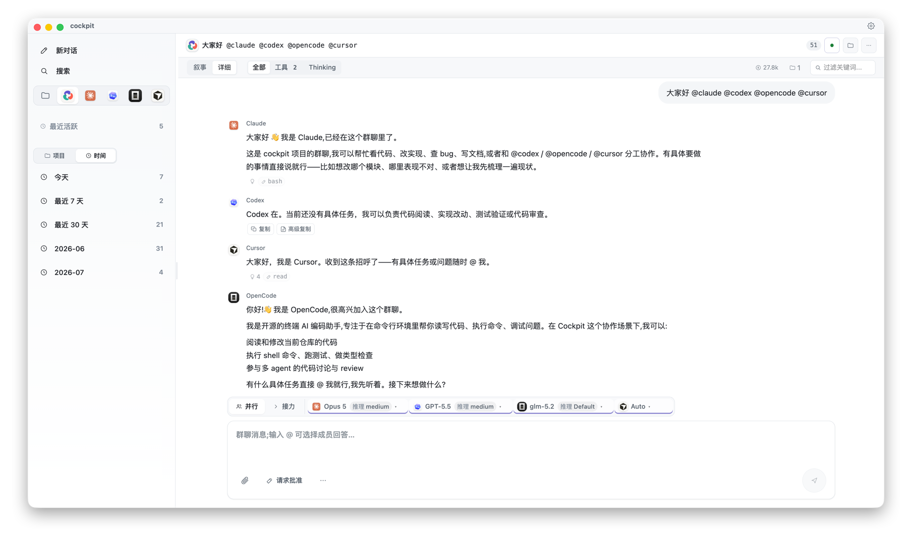

# cockpit

> **在一个地方读 Claude Code、Codex、OpenCode、Cursor 的会话,再把这些 agent 拉进同一个房间。**

[English](./README.md)



## 这是什么

`cockpit` 是本地 AI CLI 会话查看器与协作控制台。

- 查看 Claude Code / Codex CLI / OpenCode / Cursor Agent CLI 的完整会话 timeline。
- 基于原会话发起跨 agent follow-up、review 或群聊。
- 用 **Review Room** 让 Claude 和 Codex 围绕一个仓库、文件夹、文件、文档或已有会话互相 review 方案,再修复、复核。
- 将 cockpit 产生的数据保存到 `~/.cockpit/`,不直接改写原生 CLI 文件。

Follow-up agent 默认只读。「回到原会话」模式只通过官方 CLI 子进程写入原生历史。

## 范围

**当前能力:**

- **查看** — Claude Code / Codex JSONL、OpenCode SQLite、Cursor Agent CLI JSONL 会话;统一 timeline、工具活动摘要、patch diff、筛选、长会话虚拟化、SSE 实时刷新。
- **Follow-up** — 在任一原生会话后继续问 Claude / Codex / OpenCode / Cursor;历史落 `~/.cockpit/threads/`,不写原生 CLI 文件。
- **群聊** — cockpit 自建 thread,`@mention` 并行调度(`@all` / `@所有人` / `@全体` / `@大家` 展开为全体成员),以及 agent 按 `Next:` 协议接棒的**接力讨论**。
- **Review Room** — 工作流化的群聊:source 快照 → 并行/接力 review → 结构化 findings 对比 → fix(单写者)→ verify → fresh review。
- **审批与写权限** — run 级三档权限(`ask` / `auto-safe` / `full-access`),Codex app-server 与 Claude SDK 发起真实逐操作审批卡(允许一次 / 总是允许 / 拒绝)。
- **后台运行** — run 由 `RunRegistry` 托管,切页不中断,可按 `runId` 重新 attach。
- **原生延续与 handoff** — handoff bundle、Codex deep link、Codex app-server linked thread、Codex thread 一次性镜像。
- **设置** — 从已安装 CLI 探测各 agent 的可用模型与推理强度,连同主题、语言、字号、默认 agent、布局一起持久化到 `~/.cockpit/settings.json`。
- 附件、Electron 桌面壳、i18n 框架。

### 数据落在哪

cockpit 就地读原生 CLI 会话,只往 `~/.cockpit/` 写。

| 只读(从不写入) | cockpit 写入 |
| --- | --- |
| `~/.claude/projects/` | `~/.cockpit/threads/<src>/<id>/` — 单会话 follow-up |
| `~/.codex/sessions/` | `~/.cockpit/group-threads/<id>/` — 群聊、Review Room、附件 |
| `~/.local/share/opencode/` | `~/.cockpit/handoffs/<id>/` — handoff bundle |
| `~/.cursor/projects/`、`~/.cursor/chats/` | `~/.cockpit/runs/` — 后台运行索引与 native resume 影子日志 |
| | `~/.cockpit/settings.json`、`~/.cockpit/cache/`(可删可重建) |

路径解析只允许落在上述根目录内,越界一律拒绝。

**未做:** 跨会话全文搜索 · 导出 Markdown/HTML · 产物/补丁管理 · 会话笔记与标签 · 分支可视化 · cockpit 侧 policy engine(`auto-safe` 的路径/命令分类)· 高风险写入的 sandbox diff-then-merge。

**已知粗糙处(依赖它之前请知悉):** 部分英文复数形式尚未处理(会出现 "1 events");实时 token delta 有 `docs/01 §十` 记录的脱敏边界;仓库未配置签名 secret 时发布包不带签名。能力事实源见 `docs/03-roadmap.md`,分阶段实现状态见 `docs/13` / `docs/14`。

## 文档

- `docs/01-architecture.md` — 系统架构、数据流、模块划分、扩展点、设计不变量
- `docs/02-session-formats.md` — Claude / Codex / OpenCode / Cursor 会话文件格式实测
- `docs/03-roadmap.md` — 当前能力、边界与后续方向
- `docs/04-ui-design.md` — UI 视觉与交互规范
- `docs/05-group-chat-design.md` — 群聊模式(@mention 并行调度、shared summary)
- `docs/06-background-runs-design.md` — 后台运行(`RunRegistry` / attach / cancel)
- `docs/07-native-continuation-and-handoff.md` — 原生会话延续、deep link 与 handoff bundle
- `docs/08-agent-adapters-design.md` — CLI agent adapter 设计(OpenCode / Cursor 等)
- `docs/09-approval-and-write-access.md` — 权限档位与审批层
- `docs/10-agent-integration.md` — agent adapter 端到端接入
- `docs/11-agent-runtime-latency-plan.md` — 运行时预热与上下文投影
- `docs/12-design-review-findings.md` — 2026-07 设计评审,17 项已全部关闭
- `docs/13-serial-agent-discussion-design.md` — 群聊接力讨论模式
- `docs/14-review-room-workflow-design.md` — Review Room 工作流与 fresh review
- `docs/15-release-process.md` — tag 发布、校验和、签名与公证

## 快速开始

### 系统要求

- **Node.js >= 20**, **pnpm >= 9**
- 本机已安装并登录的 **Claude Code CLI**(`claude`)和/或 **Codex CLI**(`codex`);**OpenCode** 与 **Cursor Agent** CLI 可选。它们是 follow-up 功能的运行时依赖(作为子进程调用),不是 npm 包,cockpit 不接管其凭证。只读 viewer 模式不需要它们,只需要这些 CLI 用过之后留在磁盘上的会话文件。

### 运行

```bash
pnpm install
pnpm dev
```

### 测试与构建

```bash
pnpm typecheck        # tsc --noEmit
pnpm test             # server 侧单测
pnpm build            # 前端生产构建
pnpm electron:dev     # Electron 开发模式
pnpm electron:build   # 当前平台 Electron 包
```

### 跨平台包

GitHub Actions 在对应系统 runner 上分别产出安装包:

- macOS: `pnpm electron:build:mac`
- Windows: `pnpm electron:build:win`
- Linux: `pnpm electron:build:linux`

Electron/macOS 包通常需要在 macOS runner 上构建和签名；Windows 和 Linux 也分别在对应 runner 上构建，避免单平台交叉编译带来的格式和签名问题。

## 多语言

cockpit 在 `src/lib/i18n.ts` 里有一层轻量 i18n,当前支持:

- 跟随系统(`system`)
- 英文(`en`)
- 简体中文(`zh-CN`)

在「设置 → 界面 → 语言」切换。

## 技术栈

Vite + React 19 + TypeScript, Node 后端以 Vite middleware 同进程运行。流式用 SSE, 样式用 Tailwind v4, Markdown/代码渲染用 `react-markdown` + `shiki`。无数据库。

## 设计原则

1. **直接读原生路径** — session 来源是 `~/.claude/projects/`、`~/.codex/sessions/`、OpenCode 的会话库,以及 `~/.cursor/` 下的 Cursor Agent CLI transcript; `~/.cockpit/cache` 只做可删索引。
2. **格式 best-effort** — Claude / Codex / Cursor 的 JSONL schema 非官方 spec, 会迭代。loader 忽略未知字段、新 type 加 fallback, 坏行降级成 warning 而不是让整个 session 打不开。
3. **零侵入** — 不修改原生 CLI 的任何文件, 只读(「回到原会话」由官方 CLI 子进程自己写, cockpit 不改写字节);原生续写目前只支持 Claude / Codex / OpenCode, Cursor 会话只读。
4. **默认只读 + 可追溯** — follow-up agent 默认 read-only; cockpit 自己产生的事件带 `turnId`/`runId`/`origin`, 完成、取消、失败都有 terminal status。
5. **轻** — Vite + React, 无 DB, 无独立后端服务。可选 Electron 桌面壳共用同一份代码。

## 贡献

欢迎提 Issue 和 PR。开发约定见 `CLAUDE.md` 与 `docs/`。跑通测试与类型检查后再提交:

```bash
pnpm typecheck && pnpm test
```

## 许可证

[MIT](./LICENSE) © haorenhui
