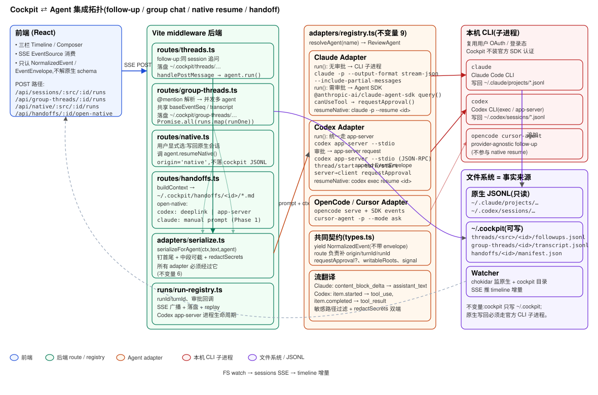

# 10 — Agent 集成开发者指南

面向想搞清楚 **cockpit 到底怎么连各个 agent** 的人:follow-up、group chat、写回原生会话、handoff,分别走的是 CLI 还是 SDK 还是 app-server,数据怎么落盘。

想快速看架构直接看下面这张图。



- 蓝 = React 前端
- 绿 = Vite middleware 后端(routes / registry / serialize)
- 橙 = Agent adapter
- 红 = 本机 CLI 子进程
- 紫 = 文件系统(原生 JSONL + `~/.cockpit/`)

## TL;DR

- **一切都走本机 CLI 子进程**,复用用户已登录的 `claude` / `codex` / `opencode` / `cursor-agent`。cockpit **不** 装官方账号 SDK,不管 OAuth。
- 有两条深集成通道,认证仍然来自本机 CLI,SDK/JSON-RPC 只是替换了 IO 通道以拿到审批钩子和逐 token 流:
  - **Claude Agent SDK**(`@anthropic-ai/claude-agent-sdk`,内部仍 spawn 本机 `claude`)
  - **Codex app-server**(`codex app-server --stdio` 的 JSON-RPC)
- 所有 adapter 都实现 `ReviewAgent` 接口,统一在 [server/adapters/registry.ts](../server/adapters/registry.ts) 注册,业务代码只调 `resolveAgent(name).run(...)` / `.resumeNative(...)`。
- 事件流一律翻成 [`NormalizedEvent`](../server/loaders/types.ts),由 route 补 `EventEnvelope`(`origin/turnId/runId`),SSE 推给前端 + 追加到 `~/.cockpit/**/*.jsonl`。
- 原生会话文件是只读的事实来源;cockpit 只写 `~/.cockpit/`。写回原生 JSONL **只能** 通过官方 CLI 子进程完成(不变量 1/2)。

---

## 一眼总览:agent × 模式矩阵

四个 agent(claude / codex / opencode / cursor)× 四种模式(follow-up / group chat / native resume / handoff open-native)。空白格代表**不支持**。

### 表 A — 底层通道

| | Follow-up 单聊 | Group chat 群聊 | Native resume 写回原生 | Handoff open-native |
|---|---|---|---|---|
| **claude** | 按有无 `requestApproval` 回调分岔(与权限档正交):ⓐ 有回调(逐工具审批,通常是 `ask` / `auto-safe`) → **Agent SDK** `query()`(本机 `claude` bin,`canUseTool` 拦截工具);ⓑ 无回调(纯生成,或 full-access 不打算弹审批) → CLI `claude -p --output-format stream-json --include-partial-messages` | 同左规则(路由是否传 `requestApproval`) | CLI `claude -p --resume <sessionId>` | `manual`:只返回 prompt,让用户自己贴进 Claude Code / Desktop |
| **codex** | **`codex app-server --stdio` JSON-RPC**(所有权限档统一走这条,full-access 时 approval 自动放行) | 同左 | CLI `codex {--sandbox read-only \| --dangerously-bypass-approvals-and-sandbox} --cd <cwd> exec resume --json <sessionId> -` | ⓐ `deeplink` → `codex://threads/new?path=&prompt=`<br>ⓑ `app-server` → `codex app-server --stdio`,`thread/start` 拿 threadId,后续 `turn/start`<br>ⓒ `cli`(预留) |
| **opencode** | CLI `opencode run --format json --dir <cwd> [--variant effort]` | — | — | — |
| **cursor** | CLI `cursor-agent -p --output-format stream-json --stream-partial-output` | — | — | — |

- 群聊、handoff 目前只调用 claude / codex。opencode / cursor 只做单聊 follow-up。
- Codex handoff 三档语义详见 [docs/07 § 和 Codex 继续](07-native-continuation-and-handoff.md#和-codex-继续)。

### 表 B — 逐 token 流式(SSE 逐字增量)

| | Follow-up | Group chat | Native resume |
|---|---|---|---|
| **claude** | ✅ SDK:`includePartialMessages: true` → `stream_event.content_block_delta`<br>✅ CLI:`--include-partial-messages` → 同上 | ✅ 同 SDK 分支 | ✅ CLI `--include-partial-messages` |
| **codex** | ✅ app-server `item/agentMessage/delta` notification | ✅ 同上 | ❌ 上游 CLI 限制,只在 `item.completed` 一次性给全,详见 [docs/07 § 已知限制](07-native-continuation-and-handoff.md#已知限制codex-native-resume-不逐-token-流) |
| **opencode** | ⚠️ 依赖 `opencode run --format json` 是否发 `delta` / `content` 事件(经 `normalizeJsonCliEvent` 兜底) | — | — |
| **cursor** | ⚠️ 已开 `--stream-partial-output`,同样依赖上游 CLI 事件形状 | — | — |

- 传输层一律 SSE(`text/event-stream` + `flush`)。"不流"指**上游 agent runtime 不吐 delta**,不是 cockpit 前后端丢帧。
- 前端合并 delta 逻辑:[src/lib/timeline.ts:73](../src/lib/timeline.ts:73),按 `streamId` 拼接;终态 `assistant_text` 到达时丢掉同 streamId 的所有 delta。

### 表 C — 事件落盘位置

| | Follow-up | Group chat | Native resume |
|---|---|---|---|
| **claude** | `~/.cockpit/threads/claude-code/<id>/followups.jsonl`<br>+ `summary.md` + `context-state.json` | `~/.cockpit/group-threads/<id>/transcript.jsonl` + `summary.md` + `state.json` | **写回 `~/.claude/projects/<hash>/<sessionId>.jsonl`**(由 `claude` 进程完成) |
| **codex** | `~/.cockpit/threads/codex/<id>/followups.jsonl` | 同上 | **写回 `~/.codex/sessions/YYYY/MM/DD/rollout-*.jsonl`**(由 `codex exec resume` 完成) |
| **opencode** / **cursor** | `~/.cockpit/threads/<src>/<id>/followups.jsonl`(用于兼容后续接入的原生 loader) | — | — |
| 附件(图片) | 群聊:`~/.cockpit/group-threads/<id>/attachments/`;单聊:`~/.cockpit/threads/<src>/<id>/attachments/`;**都不进原生 CLI 目录** | 同左 | 附件由 CLI 子进程处理写回,cockpit 只传路径 |

- Cockpit 侧写盘的都是 `EventEnvelope`(`origin: 'cockpit'` 或 `'native'`),loader 端可以按 `followup_boundary` 拼接。
- Native resume 的 cockpit SSE 事件带 `origin: 'native'`,**不落 `~/.cockpit/`**;刷新后事实源仍是 `~/.claude/projects/` 或 `~/.codex/sessions/` 的 JSONL,watcher 检测到 mtime 变化后 SSE 推增量。

### 表 D — 权限与审批

| | 权限档 | Full-access | Ask(逐工具审批) |
|---|---|---|---|
| **claude** | Cockpit 权限档 → `--permission-mode` + `--allowedTools` 组合,详见 [server/permissions/adapter-policy.ts](../server/permissions/adapter-policy.ts) | CLI `--permission-mode bypassPermissions` 直通 | SDK `canUseTool`:所有 `file_read` 类操作(`Read` / `Grep` / `Glob`,见 `isAutoAllowedClaudeRead`)自动放行,其它调 `requestApproval`,回 `allow` 时同步补 `PermissionUpdate` 加规则 |
| **codex** | Cockpit 权限档 → app-server `thread/start` 的 `sandbox` 字段,由 [`runCodexAppServer`](../server/adapters/codex-call.ts:168) 内联映射(`ask`→`read-only`、`auto-safe`→`workspace-write`、`full-access`→`danger-full-access`),thread 其余设置由 [`codexThreadSettings`](../server/adapters/codex-app-server.ts:282) 拼装 | 同上,`sandbox: 'danger-full-access'`;server → client approval request 缺 `requestApproval` 时自动 `approved` | app-server 发 `item/commandExecution/requestApproval` / `item/fileChange/requestApproval` / `item/permissions/requestApproval`(旧协议 `execCommandApproval` / `applyPatchApproval` 也兼容)server request → `mapCodexApprovalRequest` → `requestApproval` → 回 `accept`/`decline` |
| **opencode** / **cursor** | CLI flag 映射,不支持逐工具审批(headless CLI 接不住 approval 回调) | 支持 | 强制降级为 read-only,不真跑 |

审批 UI 生命周期由 [server/runs/run-registry.ts](../server/runs/run-registry.ts) 统一管:SSE 广播 `approval_required`,前端答复后调 `resolveApproval(id, status)` 唤醒 adapter 侧的 waiter。

### 表 E — 复用与副作用

| | Provider thread 复用 | 原生 session 副作用 |
|---|---|---|
| **claude follow-up** | 不复用 CLI session(每次 `claude -p` 都是 ephemeral) | 无(CLI 走 `--no-session-persistence`;SDK 走 `persistSession: false`)。**⚠️ SDK `persistSession` 默认 `true`,不显式关掉会污染 `~/.claude/projects/`,详见下方注释** |
| **claude 群聊** | 同上 | 同上 |
| **claude native resume** | 由 CLI `--resume <sessionId>` 落到目标文件 | ✅ 写回目标 `sessionId.jsonl` |
| **codex follow-up(默认)** | `thread/start` 每次新建 ephemeral thread | 无 |
| **codex follow-up(Phase 2 opt-in)** | `codexAcceleratedMode=true` 时,scope=`followup` 写 [provider-thread-link store](../server/store/provider-thread-link-store.ts),下轮直接 reuse threadId | ✅ 会新建一条 `~/.codex/sessions/…` 原生 session,后续复用 |
| **codex 群聊(Phase 2 opt-in)** | 同上,scope=`group-member` | ✅ 同上 |
| **codex native resume** | 通过 `exec resume <sid>` 直接写回目标文件 | ✅ 写回目标 rollout 文件 |
| **codex handoff `app-server`** | `runRegistry.startCodexContinuation` 长驻 thread,持有 threadId | ✅ 新建一条 `~/.codex/sessions/…` |

---

## 统一接口

[server/adapters/types.ts](../server/adapters/types.ts):

```ts
interface ReviewAgent {
  name: AgentName
  isAvailable(): Promise<boolean>          // which/--version 检测本机 CLI
  warmup?(): Promise<unknown>              // 冷启动预热:claude(可选加载 SDK)+ codex(spawn app-server lease)。触发点:/api/settings/warmup
  run(input: AgentRunInput): AsyncIterable<NormalizedEvent>
  canResumeNative?(source: string): boolean
  resumeNative?(input: NativeResumeInput): AsyncIterable<NormalizedEvent>
}
```

`AgentRunInput` 关键字段:`text` / `contextEvents` / `cwd` / `permissions` / `writableRoots` / `model` / `effort` / `requestApproval?` / `nativeLinked?` / `signal`。

- 有 `requestApproval` 回调时,adapter **可以** 走能拦截工具调用的通道(Claude Agent SDK / Codex app-server);Codex 现在无论有没有回调都走 app-server(缺省时自动放行)。
- `nativeLinked.scope` 只影响 codex adapter:传了就查/建 provider-thread-link,不传就 ephemeral(见表 E)。

不变量 6(见 [CLAUDE.md](../CLAUDE.md)):adapter 必须调 `serializeForAgent(contextEvents, text, agent)` 拼 prompt,不能直接消费原始 events。

## 四种连线方式

### 1. Follow-up(同 session 追问)

前端 `POST /api/threads/:src/:id/messages` → [server/routes/threads.ts](../server/routes/threads.ts) `handlePostMessage`:

1. 生成 `turnId` / `runId`,把 `user_text` envelope 追加到 `~/.cockpit/threads/<src>/<id>/followups.jsonl`。
2. SSE 升级,`loadSessionDetail` 拿原生 events + 已有 follow-up。
3. `resolveAgent(targetAgent).run({ text, contextEvents, cwd, signal, … })`。
4. 每条 `NormalizedEvent` 过敏感过滤 → 包 envelope → 同时落盘 + `sseWrite`。`assistant_text` 的 delta **只走 SSE 不落盘**,最终整段作为一条持久化事件。
5. 结束追加 `turn_status`(`completed` / `failed` / `aborted`)。

底层通道:

- **Claude**:[claude-call.ts:632](../server/adapters/claude-call.ts:632) `run()`
  - 有 `requestApproval`(ask 档) → `runClaudeSdk`([:545](../server/adapters/claude-call.ts:545)):动态 `import('@anthropic-ai/claude-agent-sdk')`,`query({ options: { pathToClaudeCodeExecutable: 'claude', canUseTool, includePartialMessages: true, tools: { preset: 'claude_code' } } })`。
  - 无回调(full-access) → `runClaudePrint`([:147](../server/adapters/claude-call.ts:147)):`claude -p --output-format stream-json --verbose --include-partial-messages …`,prompt 走 stdin。stdout 是 JSONL,`stream_event.content_block_delta` → `assistant_text` delta,`assistant` 行按 message id 去重 text 块,补 `tool_use` / `thinking` / `usage`。

- **Codex**:[codex-call.ts](../server/adapters/codex-call.ts) `run()` 统一 → `runCodexAppServer`([:168](../server/adapters/codex-call.ts:168))。
  - `codexRuntimeManager.acquire()` 拿到长驻 `codex app-server --stdio` lease,`thread/start` + `turn/start`。
  - 缺 `requestApproval` 时,server 发起的 approval request 自动回 `approved`(full-access 语义),让 SDK 侧接不住的问题也能通过。
  - `item/agentMessage/delta` notification → `assistant_text` delta(`delta: true, streamId`),`item/*/completed` 补 tool 结果。

- **OpenCode**:[opencode-call.ts](../server/adapters/opencode-call.ts) `runOpenCode`:`opencode run --format json --dir <cwd> [--variant <effort>]`,stdout JSONL 经 `normalizeJsonCliEvent` 翻译。
- **Cursor**:[cursor-call.ts](../server/adapters/cursor-call.ts) `runCursor`:`cursor-agent -p --output-format stream-json --stream-partial-output`,同样经 `normalizeJsonCliEvent`。

### 2. Group chat(@mention 并发多 agent)

有两条并存的路由,前端(FollowupComposer)现在只用 `/runs`:

- **`POST /api/group-threads/:id/runs`**(新,推荐)→ [group-threads.ts:404](../server/routes/group-threads.ts:404) `handleStartRun`:
  1. `readState` 校验群聊存在,读 body(`text` / `targetAgents` / `cliByAgent` / `attachments` / `permissions` / `codexAcceleratedMode`)。
  2. `parseMentions(text)` ∩ `state.agents` = 本轮目标。
  3. 调 [`runRegistry.startGroupTurn`](../server/runs/run-registry.ts:427) —— 写用户消息 + `turn_start` meta 到 `transcript.jsonl`,per-agent 起 `RunHandle`。
  4. **立即 `sendJson(202, { groupTurnId, records, userEnvelope, turnStart })` 返回,不占用 HTTP 连接**。
  5. 前端拿到 records 后,per run 调 `attachRunStream(runId)` → `GET /api/runs/:runId/stream`(SSE),run-registry 内部通过 [`projectGroupContext`](../server/runs/run-registry.ts:296) 生成上下文并跑 `resolveAgent(agent).run(...)`,`item/agentMessage/delta` 等事件走对应 run 的 SSE 通道。
  6. 每 run 独立 `run_done`,群聊层面没有"整体 done"事件,前端按 records 计数收敛。

- **`POST /api/group-threads/:id/messages`**(旧,legacy)→ `handlePostMessage` in-line SSE:一条连接吐所有 agent 的 event,末尾 `{ kind: 'done', status: 'completed'|'partial'|'failed' }`。当前代码保留但前端不走这条路。

关键点:两条路径都**复用 follow-up 的 adapter 接口**,只是 `contextEvents` 换成基于 group 快照的伪 user_text(新路径用 `projectGroupContext`,旧路径用 `group-threads.ts:76` 里的 `projectContext`),让多 agent 看到**一致的 transcript + summary + current preview**,不串戏。attachments(图片)写入 `group-threads/<id>/attachments/`,**不**进原生 CLI 目录。

### 3. 写回原生会话(native resume)

用户显式点击"回到原会话" → `POST /api/native/:src/:id/messages` → [native.ts](../server/routes/native.ts):

- 仅当 `agent.canResumeNative(source)` 且 `agent.resumeNative` 存在。目前只有:
  - `claude-code` ↔ `claude adapter`([claude-call.ts:657](../server/adapters/claude-call.ts:657)):`claude -p --resume <sessionId> [--effort]`,prompt 走 stdin,读 `--include-partial-messages` 流。
  - `codex` ↔ `codex adapter`([codex-call.ts:402](../server/adapters/codex-call.ts:402)):`codex {--sandbox read-only | --dangerously-bypass-approvals-and-sandbox} --cd <cwd> exec resume --json --skip-git-repo-check -c model_reasoning_effort="<effort>" -c model_reasoning_summary="auto" <sessionId> -`(`writeMode=read-only`/`trusted` 两档,`--cd` 在 `exec` 之前是 codex CLI 全局 flag)。prompt 走 stdin。
- SSE 事件带 `origin: 'native'`,**不写 `~/.cockpit/`**。真正的写回由 CLI 追加到 `~/.claude/projects/…` 或 `~/.codex/sessions/…`,watcher 检测到变更后 SSE 推增量给前端(不变量 2/3)。
- Codex 这条**不逐 token 流**,见表 B 与 [docs/07 § 已知限制](07-native-continuation-and-handoff.md#已知限制codex-native-resume-不逐-token-流)。

### 4. Handoff(把上下文交给另一条原生会话)

`POST /api/handoffs`(见 [handoffs.ts](../server/routes/handoffs.ts))→ `buildContext` 从当前 source(follow-up thread / group / native session)抽取上下文,写成 markdown 到 `~/.cockpit/handoffs/<id>/{manifest.json, entry-claude.md, entry-codex.md}`。

`POST /api/handoffs/:id/open-native`:

| provider | method | 做法 |
|---|---|---|
| `codex` | `deeplink` | `buildCodexDeeplink` 拼 `codex://` URL,前端 `open` 打开。prompt 超预算时返回 `fallbackPrompt` 让用户手贴。 |
| `codex` | `app-server` | `runRegistry.startCodexContinuation` 起一个 `codex app-server --stdio` 常驻子进程,`initialize` → `thread/start` 拿 `threadId`,后续 `turn/start` 用户请求。回来的 `ServerNotification` 走 `translateNotification` → `NormalizedEvent`。native-continuation 目前不接审批 UI,server-initiated request 直接 -32601 拒绝。 |
| `claude` | `manual` | Phase 1 只返回渲染好的 prompt,让用户自己粘到 `claude`。 |

Handoff 产物本身在 `~/.cockpit/`;`nativeLink.linkLevel === 'linked'`(Codex app-server)后 `runRegistry` 持有 threadId,可以后续 mirror 回 Codex thread 到 handoff 目录。

## 逐工具审批(SDK / app-server 通道)

普通 CLI 一次性 `-p` 不能中断问用户。要做逐工具审批时(`permissions.mode === 'ask'` 且路由带 `requestApproval` 回调):

- **Claude**:[claude-call.ts:545](../server/adapters/claude-call.ts:545) `runClaudeSdk`。动态 `import('@anthropic-ai/claude-agent-sdk')`,调用 `query({ prompt, options: { pathToClaudeCodeExecutable: 'claude', canUseTool, includePartialMessages: true, permissionMode: 'default', tools: { preset: 'claude_code' } } })`。`canUseTool` 把工具映射成 `Operation`(Read/Grep/Glob → `file_read` 全部自动放行,见 `isAutoAllowedClaudeRead`;其它调 `requestApproval`),返回 `allow` 时顺带补 `PermissionUpdate` addRules/addDirectories。**注意 SDK 仍然通过本机 `claude` 可执行文件运行 agent 循环,cockpit 不需要 API key**。
- **Codex**:[codex-call.ts:168](../server/adapters/codex-call.ts:168) `runCodexAppServer`。起 `codex app-server --stdio`,`initialize` → `thread/start`(带 sandboxPolicy / approvalPolicy)→ `turn/start`。收 server → client request(`execCommandApproval` / `applyPatchApproval` / `item/*/requestApproval`)→ `mapCodexApprovalRequest` 转 `Operation` → `requestApproval` → 回 `accept` / `decline`。缺 `requestApproval` 时自动放行(full-access 语义)。
- **run-registry** 层负责创建 `ApprovalRequest`,在 SSE 上广播 `approval_required`,前端答复后调 `resolveApproval(id, status)` 唤醒 waiter。

## Serialize 边界

[serialize.ts](../server/adapters/serialize.ts) 是 adapter 与上下文之间的强边界:

- 拆 `followup_boundary`:边界前是原生 events,边界后是 cockpit follow-up,不按 ts 重排(不变量 3)。
- 分区块:User Goal / Timeline / Tool Activity / Follow-up History / Final Response / Current Request。首尾钉住,中段超预算从中间腰斩。
- 全程 `redactSecrets`,tool input/output 有独立字符预算。
- adapter 拿到的是一整段 markdown 文本(Claude / Codex CLI 都当 prompt 塞进去),不是结构化事件。

## 不落原生目录的显式开关

不变量 1 要求 cockpit **不能**写 `~/.claude/projects/` 或 `~/.codex/sessions/`(native resume / handoff-linked 是明示的例外)。每条通道各有一个必须显式设的开关,漏掉就会静默泄漏 follow-up 到原生目录:

| 通道 | 开关 | 位置 |
|---|---|---|
| Claude CLI `-p` | `--no-session-persistence` | [claude-call.ts:632](../server/adapters/claude-call.ts:632) 传给 `runClaudePrint` 的 `extraArgs` |
| Claude Agent SDK `query()` | `persistSession: false` | [claude-call.ts](../server/adapters/claude-call.ts) `runClaudeSdk` 的 options |
| Codex app-server `thread/start` | `ephemeral: true` | [codex-call.ts](../server/adapters/codex-call.ts) `runCodexAppServer`,`linkScope == null` 时自动 true |

**特别注意 Claude Agent SDK 的 `persistSession` 默认是 `true`**,类型定义有 `@default true`。不显式关掉,SDK 每 turn 都会往 `~/.claude/projects/<hash>/{sessionId}.jsonl` 落一份原生 session。历史上确实发生过这种泄漏,验证方法:在原生目录里 grep 找 cockpit 的 prompt 头(`Cockpit Follow-up History` / `# Original Session\n\n## User Goal`)。

只有以下三条通道**应当**落到原生目录,别的都必须关掉:

- Claude / Codex 的 native resume(用户显式点"回到原会话")
- Codex handoff `app-server` 模式(用户显式勾选深集成)
- Codex Phase 2 opt-in follow-up / 群聊(`codexAcceleratedMode: true`,provider-thread-link 写表 + 复用 native thread)

## 目录一览

```
server/
  adapters/
    types.ts              ReviewAgent 接口
    registry.ts           agentName → adapter
    claude-call.ts        claude CLI (--include-partial-messages) + Agent SDK (includePartialMessages:true)
    codex-call.ts         永远走 codex app-server(不再有 CLI exec 分支)
    codex-app-server.ts   JSON-RPC 客户端 + 事件翻译(item/agentMessage/delta 逐 token)
    codex-runtime-manager.ts  长驻 app-server 进程池 + warmup
    opencode-call.ts      opencode CLI
    cursor-call.ts        cursor-agent / agent CLI(两个候选二进制)
    serialize.ts          serializeForAgent(边界 6)
    context-projector.ts  follow-up 的 EventEnvelope → 传给 adapter 的 contextEvents(与群聊侧的 projectGroupContext 对称)
    sensitive.ts          redactSecrets + filterToolResult
  routes/
    threads.ts            follow-up SSE
    group-threads.ts      group chat SSE
    native.ts             写回原生会话 SSE
    handoffs.ts           handoff 创建 + open-native
  runs/
    run-registry.ts       runId/turnId、审批、Codex app-server 生命周期
    run-store.ts          RunRecord JSONL
    native-shadow-store.ts native resume 影子记录
  store/
    provider-thread-link-store.ts  Phase 2 opt-in:codex followup/group threadId 复用表
  loaders/                claude / codex / cockpit JSONL → NormalizedEvent
  handoffs/               context-builder / capabilities / codex-deeplink
  store/                  thread-store / group-thread-store / handoff-store
```

## 加一个新 agent 的最短路径

1. 写 `server/adapters/foo-call.ts`,实现 `ReviewAgent`。`isAvailable` 用 `commandExists('foo', ['--version'])`,`run` spawn CLI,把 stdout JSONL 翻成 `NormalizedEvent` 并 `yield`。想让 UI 看到打字机效果:`assistant_text` 加 `delta: true` + 稳定 `streamId`,终态时不带 `delta`(见 [timeline.ts:73](../src/lib/timeline.ts:73) 的合并逻辑)。
2. 在 [registry.ts](../server/adapters/registry.ts) 加一行 `registerAgent(fooAdapter)`。
3. `AgentName` 类型加成员;[src/lib/agents.ts](../src/lib/agents.ts) 补显示名、图标、默认模型等 UI 元数据。
4. 只做 follow-up / group 就够了;想支持写回原生会话再实现 `canResumeNative` + `resumeNative`,并添加一个 loader 把它的原生 JSONL 也读进 timeline。

**不要**在 route 或 UI 里 `if (agent === 'foo')`(不变量 9/10)。差异化配置(默认 model、颜色)透过 adapter 表达,不透过分支。

## 已知限制汇总

- **Claude SDK 落原生目录的历史泄漏**:2026-07 之前 `runClaudeSdk` 没显式关 `persistSession`(SDK 默认 `true`),ask 档单聊 + 所有 Claude 群聊都会往 `~/.claude/projects/<hash>/*.jsonl` 落一份 cockpit follow-up。修复后新 run 不再落,历史文件仍在原生目录里,可以 grep `# Original Session\n\n## User Goal` 找出来手动清理。
- **Codex native resume 不逐 token 流**:上游 `codex exec resume --json` 只发 `item.completed`,不发中间态。详见 [docs/07 § 已知限制](07-native-continuation-and-handoff.md#已知限制codex-native-resume-不逐-token-流)。
- **OpenCode / Cursor 的逐 token**:取决于各自 CLI 是否在 `--format json` / `--stream-partial-output` 下发 delta 事件,由 `normalizeJsonCliEvent` 兜底识别 `type: '*delta*'` 或 `content` 字段。未验证过所有版本行为。
- **Claude / Codex handoff-native-continuation 不接审批 UI**:server-initiated approval request 直接 -32601 拒绝(见 handoff 表)。要接需要把 native-continuation run 也接进 `run-registry.requestApproval`。
- **Group chat 不写回原生 session**:multi-agent 在同一 turn 内并发写同一原生 session 会有互相覆盖的风险,当前设计明确回避(不变量 1)。
